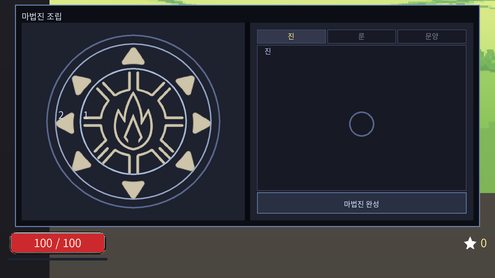

# 탁본 (Tockbon)

마법진을 직접 조립해 나만의 마법을 만드는 2D 횡스크롤 로그라이크.

**[▶ 브라우저에서 바로 플레이](https://djgnfj-svg.github.io/tockbon/)** — 설치 없이 열린다.



## 무엇이 다른가

마법진은 **진 · 룬 · 문양** 셋으로 이루어진다. 진은 틀, 룬은 가운데에 꽂아 속성을 정하고,
문양은 층에 올려 맞았을 때 무엇을 할지를 정한다.

**안쪽 층부터 바깥으로 해석하기 때문에 조합이 아니라 순열이다.**
확산 다음 폭발이면 여덟 갈래로 흩어진 뒤 각각 터지고, 폭발 다음 확산이면 크게 터진 뒤 흩어진다.
같은 두 장으로 다른 마법이 나온다.

지형은 셀 단위로 파이고, 불은 연료가 있는 곳에만 번지고, 물은 파인 구멍으로 흘러 들어간다.

## 조작

| 키 | 동작 |
|---|---|
| A / D · Space | 이동 · 점프 |
| 마우스 좌클릭 | 발사 |
| Tab | 조립 창 |
| V | 레벨업 3택 창 |
| F | 마을 설비 사용 |
| R · ESC | 판 리셋 · 창 닫기 |

## 문서

| | |
|---|---|
| [게임 소개 및 설명](docs/submission/plan.md) | 무엇을 만들었고 무엇이 아직 아닌가 |
| [AI 활용 기술 문서](docs/submission/ai-tech.md) | 이 게임을 만든 AI 작업 구조 전부 |
| [GDD](docs/GDD.md) | 게임 전체 설계 |

`docs/design/`은 기능별 설계, `docs/decisions/`는 **하지 않기로 한 것과 그 이유**,
`docs/plans/`는 진행 상태별 구현 계획이다.

## 직접 빌드하려면

Godot **4.7.1**로 저장소를 열고 `Web` 프리셋으로 내보낸다. 엔진 바이너리는 커밋하지 않는다.

```powershell
.\Godot_v4.7.1-stable_win64.exe --headless --export-release "Web" build\web\index.html
```

검증은 `tests/run_nets.ps1` 하나로 돈다 — 38개 그물, 8,485개 검사, 약 24초.

```powershell
powershell -ExecutionPolicy Bypass -File tests\run_nets.ps1
```

## 만든 것

1인 개발. 그림은 전량 자체 생성(로컬 ComfyUI, 일부 애니메이션만 PixelLab)이고,
**효과음은 파일이 아니라 부팅 때 코드가 합성한다** — 저장소에 오디오 파일이 하나도 없다.
외부 에셋은 폰트 하나뿐이다: Noto Sans KR (SIL OFL 1.1, `assets/font/OFL.txt` 동봉).

엔진은 Godot Engine (MIT).
