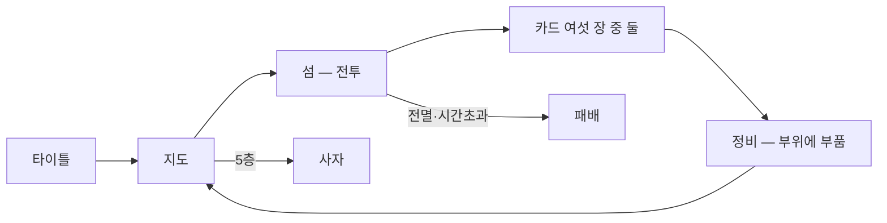

# 세포 군대 — GDD

> ## 먹을 것을 고르러 간다
>
> 네모난 세포 열 마리로 시작해 **섬을 하나씩 먹고**, 먹은 것으로 **내 군대를 만들어**, 마지막 섬의
> 사자와 붙는다.

⚠ **한 장을 넘기지 않는다.** 넘어가면 아무도 안 읽는다. 자세한 건 코드와 계획서에 있다.

---

## 한 판이 어떻게 흐르나

- **지도** — 5층 7노드. 갈라졌다 다시 합쳐지고, 전체가 늘 보인다. 마지막은 사자
- **섬** — 착지 지점과 순서를 정하고 **시작**을 누르면, 그다음은 구경한다
- **보상** — 이긴 섬이 카드 여섯 장을 내고 **둘을 고른다**
- **정비** — 부위 여섯 칸에 부품을 놓아 그 소환 슬롯의 몸을 바꾼다

> 🖼 **여기에 그림** — 지도 한 장, 섬 한 장, 정비 화면 한 장

---

## 어떻게 싸우나

**전투 중에는 손이 안 움직인다.** 시작 전에 다 정한다.

- **바다를 누르고 있으면** 그 자리에 세포가 배로 나와 **알아서 가까운 해안으로 간다**
- 누를 수 있는 곳은 **해안에서 여섯 칸 떨어진 바다 띠**
- **병사는 섬을 건너 이어진다. 체력도 이어지고, 죽으면 영영 죽는다**
- 내 병사는 **탐지 범위가 없다** — 가장 가까운 적으로 계속 걸어간다. **적은 탐지 범위가 있다**

⇒ **그래서 어디에 내리느냐가 누구와 붙느냐를 정한다.** 이게 이 게임의 결정이다.

> 🖼 **여기에 그림** — 소환 띠와 배가 가는 그림

---

## 지금 실제로 서 있는 숫자

| | |
|---|---|
| 시작 병력 | **세포 열** — 근접 6, 원거리 4 |
| 소환 슬롯 | **둘** (근접 · 원거리) |
| 적 종류 | **셋** — 들소 · 까마귀, 그리고 보스인 **사자**(체력 140, 예비동작 0.6초) |
| 섬 | **넷** — 48×32 셋, 144×32 하나 |
| 시간 제한 | **60 · 60 · 90초** |
| 지는 조건 | 전멸 · 시간 초과 · 상륙 실패 |
| 부위 | **여섯** — 머리(사거리) 가슴·배(체력) 팔(공격력) 손(공격주기) 다리(이동속도) |
| 보상 | 카드 **여섯 중 둘** |

---

## 아직 안 정한 것

- **재밌는가.** 지금까지 통과한 건 **연출과 소환 동작**뿐이다. 게임 자체는 한 번도 통과한 적이 없다
- **보상 축이 셋이었는데 지금은 둘뿐이다** — 아티팩트와 보물섬은 코드에 없다
- **판이 끝난 뒤에 뭐가 남는가** — 해금이 하나도 없다
- **몸이 어떻게 보이는가** — 지금은 코드가 그리는 네모와 선이다
- **속도 조절** — 코드에는 남아 있지만 화면에서 뺐다

---

⚠ **이 문서는 「무엇을 만드는가」만 적는다.** 무엇이 언제 뒤집혔는지는 **접은 갈래**(같은 폴더)와
git 기록에 있다.
