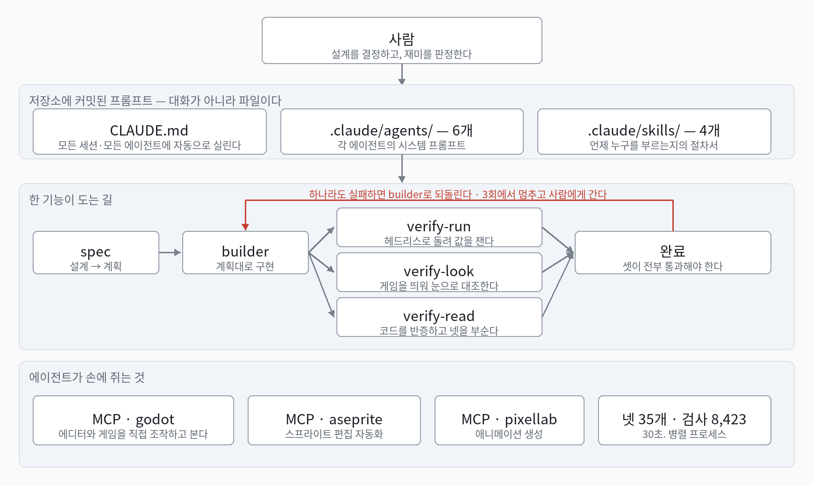

# AI 활용 기술 문서 — 탁본 (Tockbon)

이 문서는 이 게임을 **8일 만에 만든 AI 작업 구조를 그대로 공개하는 문서다.**
에이전트 정의도 스킬도 규칙 파일도 전부 공개 저장소에 파일로 들어 있고, 그대로 가져가 쓸 수 있다.
자랑할 것은 완성도가 아니라 속도이고, 그 속도는 코드를 빨리 쓴 데서가 아니라
**AI가 거짓말을 못 하게 막은 데서** 나왔다.

*(1인 개발, 8일, 커밋 183개. 수치는 제출 시점 측정.)*

---

## 1. 기본 골조

1. **기획을 먼저 정의한다.** AI가 사용자와 브레인스토밍하고, 합의된 것만 설계 문서로 떨군다.
2. 그 문서가 **구현 계획 → 구현 → 검증**으로 흐른다.
3. **검증에서 걸리면 구현 담당에게 되돌아가 고친다.** 3회 되돌려도 안 되면 멈추고 사람에게 간다.
4. **검증은 셋이 각각 다른 것을 본다.** 돌려서 값을 재는 쪽, 띄워서 눈으로 보는 쪽, 코드를 적대적으로 읽는 쪽.
   셋이 전부 통과해야 완료다.
5. **사람은 맨 위에 있다.** 설계를 결정하고, 재미를 판정한다. 그 둘은 위임하지 않았다.



**프롬프트는 대화가 아니라 파일이다.** `CLAUDE.md`는 모든 세션과 모든 에이전트에 자동으로 실린다.
대화창에 친 문장은 그 세션과 함께 사라지지만, 파일에 박힌 규칙은 다음 세션의 첫 줄부터 다시 실린다.
그래서 이 프로젝트에서 프롬프트 엔지니어링은 **파일을 고치는 일**이다.

### Godot을 고른 이유는 MCP다

엔진 선택의 첫 기준이 **"AI가 이 엔진을 직접 볼 수 있는가"**였다.
`godot-mcp`가 붙으면 에이전트가 이런 것을 한다.

| 무엇 | 왜 필요했나 |
|---|---|
| 씬과 노드를 읽고 고친다 | 코드가 아니라 씬에만 있는 배선을 확인한다 |
| 게임을 띄우고 입력을 주입한다 | "플레이하면 이렇게 된다"를 사람 없이 재현한다 |
| 게임 시간을 멈추고 한 프레임씩 민다 | 프레임 단위 판정을 잰다 |
| 실행 중인 게임 안에서 GDScript를 실행한다 | 보스 앞까지 걸어가지 않고 그 상황만 세운다 |
| 런타임 상태를 텍스트 요약으로 받는다 | 스크린샷보다 훨씬 싸다. 값 확인은 전부 이쪽 |
| 에디터가 자기 뷰포트를 캡처한다 | 마지막에 눈으로 볼 때만 |

---

## 2. 에이전트별 역할

`.claude/agents/`의 파일 하나가 에이전트 하나의 시스템 프롬프트다. 아래는 그 프롬프트 요약이다.

| 에이전트 | 역할 | 금지 |
|---|---|---|
| spec | 설계 문서를 구현 계획으로 바꾼다 | 코드를 쓰지 않는다 |
| builder | 계획에 적힌 것만 구현한다 | 계획도, 측정도, 완료 선언도 하지 않는다 |
| verify-run | 헤드리스로 돌려 계획의 「인수 조건」을 값으로 확인한다 | 코드를 읽지 않는다 |
| verify-look | 게임을 띄워 계획의 「화면」과 눈으로 대조한다 | 수치로 판정하지 않는다 |
| verify-read | 코드를 적대적으로 읽어 반증하고, 넷을 일부러 부순다 | 게임을 띄우지 않는다 |
| harness-manager | 넷이 느려지거나 헛돌면 재고 고친다 | 기능 코드를 건드리지 않는다 |

**금지 열이 설계의 본체다.** 무엇을 못 하는지가 경계를 만든다.
builder가 자기 작업을 자기가 재면 언제나 유리하게 읽히고, 그것이 "돌아가는 척하는 코드"의 출생지다.

`.claude/skills/`의 스킬 넷은 **언제 누구를 부르는지**의 절차서다.

| 스킬 | 역할 |
|---|---|
| game-planning | 사용자와 대화하며 기능을 설계하고 문서로 떨군다 |
| build-feature | 그 문서 하나를 팀으로 구현한다. 다섯 에이전트를 띄우고 조율한다 |
| harness-audit | 하네스를 점검해 문제만 보고한다. 아무것도 고치지 않는다 |
| wrap-up | 실제로 끝난 것만 문서에 반영하고, 넷을 돌리고, 커밋한다 |

---

## 3. 아트와 사운드 파이프라인

그림도 전량 AI로 만들었다. 다만 어디서 뽑느냐를 나눴다.

```
프롬프트 + 프리셋 → 로컬 ComfyUI 배치 8장 → 한 장의 시트로 붙임 → 사람이 눈으로 하나 고름
   → 배경 컷 → assets/ 로 이동 → (움직여야 하면) PixelLab → 시트 + GIF
```

정지 프레임과 UI는 **로컬 ComfyUI**(이 PC의 GPU)에서 뽑는다. 크레딧이 안 드니 배치로 마음껏 뽑는다.
네발짐승 걷기만 **PixelLab**을 쓴다 — 로컬 워크 LoRA가 사람용이라 동물 걷기는 로컬 경로가 없다.

**말로는 안 갈린다.** 후보를 시트 한 장에 붙여 놓고 사람이 고르는 단계가 이 파이프라인의 중심이다.
프리셋 한 항목이 문체·LoRA 강도·크기를 함께 들고 있어서 스타일이 갈라지지 않는다.

**참고 이미지는 넣지 않았다.** 레퍼런스를 스타일 참조로 넣으면 그 그림 자체를 거의 복제한다.

### 사운드는 파일이 아니라 코드다

**저장소에 `.wav`도 `.ogg`도 한 개도 없다.** 효과음은 부팅 때 **코드가 PCM을 직접 합성한다.**
발사·폭발·점프·착지·피격이 전부 그렇게 만들어진다.

호출 시점이 아니라 부팅 때 한 번 굽는 이유는 발사가 클릭마다 울리는 핫 패스이기 때문이고,
소리마다 노드를 만들지 않고 고정 풀을 쓰는 이유는 폭발이 한 틱에 여러 개 겹치는 것이
드문 경우가 아니라 보통의 경우이기 때문이다.

**이 선택이 검증까지 바꿨다.** 파일이 없으니 "무슨 파일을 재생했나"를 물을 수 없고,
대신 **"울렸는가"를 셀 수 있다.** 재생 호출을 전부 세어 두기 때문에 헤드리스 넷이 그 수를 읽는다 —
"소리가 좋은가"는 못 재도 "그 순간에 울렸는가"는 잰다. 이 저장소의 규칙 그대로다.

---

## 4. AI에게 실제로 준 지시

프롬프트는 대화가 아니라 `CLAUDE.md`와 `.claude/agents/*.md`에 **파일로** 있다.
아래는 그중 **결과를 실제로 바꾼 문장들**이고, 전부 공개 저장소에 그대로 들어 있다.

**거짓말을 막는 규칙** — `CLAUDE.md`의 「가짜 코드 금지」:

```
돌아가는 척하는 코드는 안 돌아가는 코드보다 나쁘다.
- 이 입력에만, 이 테스트에만 맞춘 하드코딩
- 계산하지 않고 그럴듯한 값을 돌려주기
- 스텁을 완료라고 보고하기
- 에러를 삼켜 성공처럼 보이게 하기
- 화면은 바뀌는데 시뮬레이션은 안 바뀐다(또는 그 반대) — 대표적인 가짜
못 하겠으면 못 하겠다고 말한다.
```

**검사 자체를 의심하게 만드는 규칙** — 「가짜 넷 금지」:

```
새로 만든 검사는 전부 뒤집어 본다. 뒤집지 않은 검사는
"돌아간다"를 증명할 뿐 "잰다"를 증명하지 않는다.
뒤집어서 안 물면, 검사를 의심하기 전에 뮤테이션이 실제로 들어갔는지부터 확인한다.
```

이 한 줄이 실제로 잡은 것 — **셰이더가 통째로 깨져도 검사 39개가 초록이었고, 0번 도는 정착 루프가
통과했고, 화면 문구가 크기 0으로 그려져도 320개가 통과했다.**

**역할의 경계는 「할 일」이 아니라 「금지」로 준다.** 2절 표의 금지 열이 그대로 시스템 프롬프트다 —
builder의 파일에는 *"계획도, 측정도, 완료 선언도 하지 않는다"*가 박혀 있다.

**폴더가 계약이고, 그 계약도 프롬프트다**:

```
src/sim/    정수 결정론. float · Vector2 · sqrt · sin · randi · OS. · Time. 금지
src/view/   화면만. 시뮬레이션을 읽되 절대 쓰지 않는다
```

**사람에게 답하는 방식까지 파일에 있다** — 답장은 한국어로, 전체 50자 이내.
길게 쓰면 안 읽히고, 안 읽히면 검토가 통과 도장이 된다.

---

## 5. 장점

1. **한쪽에서 빌드를 돌리는 동안 다른 쪽에서 기획을 할 수 있다.** `docs/`를 그렇게 나눴다 —
   `plans/1.ready`(다음에 만들 것) · `2.active`(지금 만드는 것) · `3.done`, 그리고
   `design/`(이 기능이 무엇인가) · `decisions/`(왜 그건 안 했나).
   기획 세션은 `1.ready`에 문서를 쌓고 구현 세션은 `2.active` 하나만 본다.
   **서로의 파일을 안 건드리니 세션을 갈라도 충돌하지 않는다.** 8일이라는 기간은 이 갈라짐 없이는 안 나온다.
2. **그림이 싸다.** GPU 스펙만 받쳐주면 로컬 오픈소스(ComfyUI)로 후보를 여러 장 한 번에 뽑고,
   고른 것에 애니메이션까지 붙여 그대로 게임에 넣는다. **크레딧이 안 든다** — 88장이 그렇게 나왔다.
3. **거짓 보고가 구조로 걸린다.** 만든 자와 재는 자가 나뉘어 있어서 "됐습니다"가 통과 근거가 되지 못한다.
4. **다음 세션이 이어받는다.** 결정과 기각이 그때그때 문서로 박히므로,
   새 세션에 처음부터 다시 설명하지 않아도 된다.

---

## 6. 한계점

**에디터 브릿지는 클라이언트를 하나만 받는다.** 그런데 에이전트마다 MCP 서버가 붙어 서로 포트를 뺏는다.
프롬프트로 "쓰지 마"라고 막는 것은 안 먹혔다 — 서버가 도구 호출과 무관하게 세션 시작 때 붙기 때문이다.
⇒ **화면을 보는 에이전트를 하나로 줄이는 것이 유일한 해법이었고, 병렬성을 그만큼 포기했다.**

---

## 7. 오픈소스 출처 · 라이선스

| 무엇 | 라이선스 | 어디에 |
|---|---|---|
| Godot Engine 4.7.1 | MIT | 게임 엔진. 넷도 이 바이너리의 헤드리스 모드로 돈다 |
| Claude Code (Anthropic) | 상용 | 에이전트·스킬·오케스트레이션의 실행 기반 |
| MCP (Model Context Protocol) | 개방 규격 | AI ↔ 외부 도구 프로토콜 |
| godot-mcp | 오픈소스 | AI가 에디터와 게임을 제어 |
| ComfyUI | GPL-3.0 | 픽셀아트 생성. 본체와 모델 12GB는 저장소 밖 |
| aseprite-mcp | 오픈소스 | 스프라이트 편집 자동화 |
| PixelLab | 상용 API | 애니메이션 생성 |
| Aseprite | 상용 | 스프라이트 편집기 |
| Python 3.10 | PSF | 에셋 생성 도구 |
| Noto Sans KR | SIL OFL 1.1 | 한국어 표시. 라이선스 전문을 `OFL.txt`로 동봉 |

**외부 에셋은 폰트 하나를 빼면 없다.**

| 종류 | 개수 | 출처 |
|---|---|---|
| 이미지 (`assets/` png) | 88 | 전량 자체 생성 — 로컬 ComfyUI, 일부 애니메이션만 PixelLab |
| 지형 데이터 | 1 | 사람이 직접 그린 PNG를 도구로 구움 |
| 사운드 파일 | 0 | 가져온 것이 없다. 효과음은 부팅 때 **코드로 합성한다** |
| 폰트 | 1 | Noto Sans KR (SIL OFL 1.1) |

**타인의 이미지와 사운드를 가져다 쓴 것이 하나도 없다.**
AI 생성물의 권리는 각 서비스 이용약관에 따라 이용자에게 귀속된다.

준수 사항 — 엔진 바이너리는 커밋하지 않는다. 폰트는 라이선스 전문과 함께 배포하고 이름을 바꾸지 않았다.
ComfyUI는 **로컬에서 도구로 실행할 뿐 코드를 배포물에 넣지 않는다.**
MCP 설정 파일은 API 키가 평문이라 커밋하지 않으며, 공개 전환 전에 전체 커밋 히스토리를 훑어 시크릿 0건을 확인했다.
