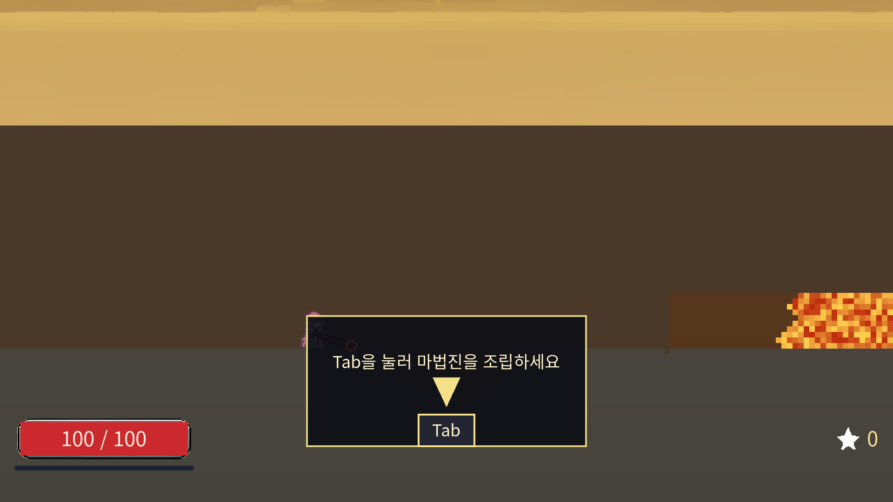
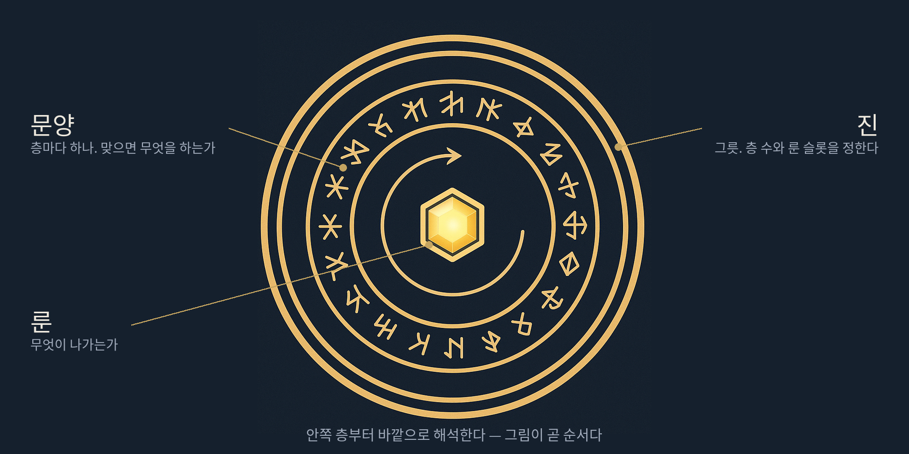
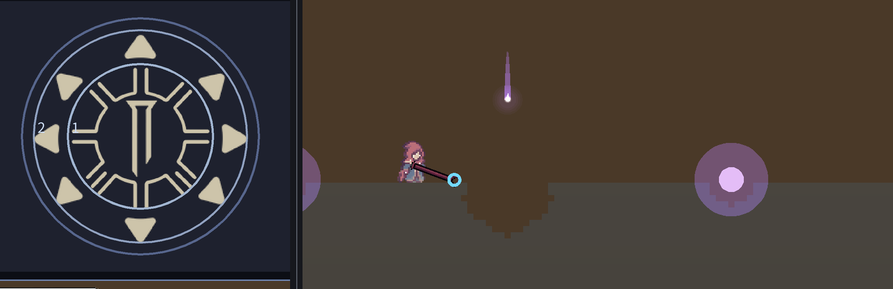
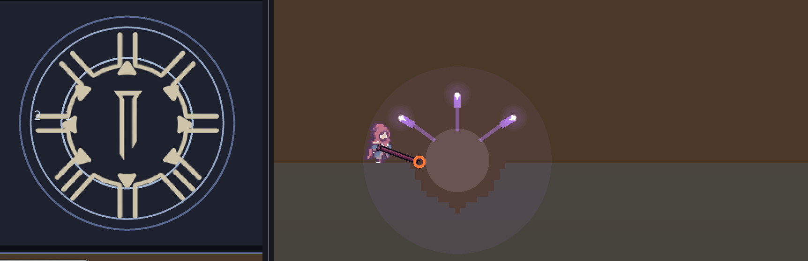

# 탁본 (Tockbon)

| | |
|---|---|
| **게임 제목** | **탁본 (Tockbon)** |
| **한 줄 소개** | 마법진을 직접 조립해 나만의 마법을 만드는 2D 횡스크롤 로그라이크 |
| **플레이 링크** | https://djgnfj-svg.github.io/tockbon/ — 설치 없이 브라우저에서 바로 실행 |
| **플레이 영상** | `(업로드 후 기입)` |
| **소스 코드** | https://github.com/djgnfj-svg/tockbon |

탁본은 새겨진 것을 종이에 떠내는 일이다. 이 게임은 마법진을 새기고, 그것이 세계에 찍히는 것을 보는 게임이다.

## 개요

장르는 2D 횡스크롤 로그라이크다. **1인이 8일 만에 만들었다.**

마법진을 직접 조립해 나만의 마법을 만드는 것이 이 게임의 핵심 재미다.


마법진은 진, 룬, 문양 셋으로 이루어진다.

- 진은 마법진의 틀이다. 층이 몇 개이고 룬을 몇 개 꽂을 수 있는지가 진마다 다르다
- 룬은 가운데에 꽂는다. 불 룬이면 불이 나가고 물 룬이면 물이 나간다.
  불은 닿은 곳을 태우고 물은 적신다 — 속성마다 세계에 남기는 것이 다르다
- 문양은 층에 넣는다. 나간 마법이 맞았을 때 무엇을 할지가 문양이다.
  확산이면 여덟 갈래로 흩어지고 폭발이면 터진다

셋이 서로 다른 것을 바꾸기 때문에 외울 표가 없다. 짐작한 대로 조립하면 짐작한 대로 나온다.

조립한 마법진은 세계에 발현된다. 지형은 셀 단위로 파인다. 불은 연료가 있는 곳에만 번진다.
물은 파인 구멍으로 흘러 들어가고, 맞은 것은 젖는다.
속성이 세계의 자연법칙과 맞물리는 자리를 목표로 한다.



그 마법진 하나로 앞을 막는 장애물을 헤쳐 나가는 게임이다.
부서지는 세계와 주문 조합은 노이타, 횡스크롤 로그라이크의 구조는 데드셀을 참고했다.
다른 것은 조립의 축이다. 주문을 목록으로 늘어놓는 대신 마법진의 층에 쌓기 때문에,
무엇을 얻었느냐보다 어떤 순서로 쌓았느냐가 빌드를 가른다.

---

## 마법진 조립식



가운데에 룬을 꽂는다. 그 바깥으로 층이 있고, 층마다 문양을 하나씩 올린다.
안쪽 층부터 바깥으로 해석한다. 그림이 곧 순서다.

탄은 자기가 지나갈 문양 목록을 들고 날아간다. 무언가에 맞으면 목록의 첫 번째를 실행한다.
목록이 비면 끝난다. 그래서 마법진은 목록이 아니라 파이프라인이다.

문양은 하는 일에 따라 셋으로 나뉜다.

- 변형은 충돌을 기다리지 않는다. 목록에 닿는 순간 마법 자체를 바꾼다.
  지금은 위력을 바꾸는 것까지 들어갔고, 가속·유도·회전은 준비 중이다
- 생성은 새 탄을 만들고, 남은 목록을 그 탄들에게 넘긴다. 확산이 여기 든다
- 종결은 탄을 만들지 않는다. 다음 문양이 같은 자리에서 이어진다. 폭발이 여기 든다

### 같은 재료, 순서만 바꾸면 다른 마법이 된다

확산과 폭발 두 장으로 만들 수 있는 마법은 두 가지다.
아래 두 그림은 왼쪽이 조립한 마법진, 오른쪽이 그 마법진이 세계에 낸 자국이다.
같은 자리에 같은 횟수를 쐈고, 바꾼 것은 층 순서뿐이다.

확산 다음 폭발이면, 맞은 자리에서 여덟 갈래로 흩어지고 그 여덟이 각각 터진다.
여러 군데에서 동시에 터진다.



폭발 다음 확산이면, 맞은 자리에서 먼저 크게 터지고 거기서 여덟 갈래가 흩어진다.
한 군데가 크게 터지고 불씨가 퍼진다.



그래서 조합이 아니라 순열이다. 문양이 셋이면 여섯 가지, 넷이면 스물네 가지가 된다.
문양을 몇 장 얻었느냐보다 어떤 순서로 쌓았느냐가 빌드를 가른다.

---

## 메인 루프

```
마을에서 마법진을 짠다 → 출발 → 스테이지 → 클리어 또는 사망 → 마을 → 영구 연구 → 다시 출발
```

판이 끝나면 이번 판에서 얻은 룬은 사라지고, 마을의 연구만 남는다.
연구를 하나 사면 다음 판의 출발 사항이 달라진다.

지금 할 수 있는 연구는 셋이다.

- 불 룬 — 처음부터 들고 나간다
- 물 룬 — 처음부터 들고 나간다
- 2단 점프 — 지난 판에 보고도 못 올라간 자리에 올라간다

---

## 세션 루프

```
싸운다 → 레벨업 → 셋 중 하나 고름 → 마법진에 올림 → 다시 싸운다
```

한 판 안에서 마법진은 이 한 갈래로만 자란다. 몬스터는 경험치와 돈만 주고, 문양은 주지 않는다.
레벨이 오르면 표시가 뜨고, 안전한 곳에서 눌러 셋 중 하나를 고른다. 보스도 같은 창을 연다.

- 후보로 뜨는 것은 **현재는 문양이다.** 진과 장비도 나중에 같은 창으로 들어온다
- 문양에는 등급이 있어서, 이미 가진 문양의 **상위 등급**도 후보가 된다
- **넣어둘 곳이 없다.** 받는 순간 어느 층에 올릴지 정하고, 층이 찼으면 무엇을 밀어낼지 정한다
- 셋 다 마음에 안 들면 **안 받아도 된다**
- 고르는 동안에도 세계는 멈추지 않는다

---

## 스테이지 1

300×48 타일 한 장이 끊김 없이 이어진다. 로딩도 문도 없다.

```
잡몹 3무리 → 황소(중간보스) → 나무벽을 태움 → 잡몹 → 거대 수탉(보스) → 게이트
```

가는 길을 나무벽이 막고, 그 벽은 불로만 태울 수 있다.
불 룬은 구덩이 속 황소가 삼켰으니 잡아서 되찾아야 길이 열린다.
중간보스는 강해지는 곳이 아니라 그것 없이는 못 지나가는 곳이다.

황소를 잡으면 그 구덩이로 물이 쏟아진다. 물속에서는 점프가 무제한이라 물은 장애물이자 이동 수단이다.

연구로 불 룬을 사 두면 이 구간이 통째로 달라진다. 황소를 건너뛰고 벽을 태우고 지나갈 수 있다.
맵은 손으로 그린 고정 맵이라, 판마다 달라지는 것은 지형이 아니라 내가 들고 간 마법진이다.

---

## 실행 방법

설치가 필요 없다. 위의 플레이 링크를 열면 약 40MB를 내려받고 바로 시작된다.
데스크톱 Chrome 또는 Edge 최신 버전을 권장한다. 플러그인도 계정도 필요 없다.

소스에서 직접 빌드하려면 Godot 4.7.1로 저장소를 열고 `Web` 프리셋으로 내보내면 된다.

---

## 게임 방법

**목표.** 스테이지 1을 끝까지 통과하는 것이다.
가는 길을 나무벽이 막고 그 벽은 불로만 태울 수 있는데, 불 룬은 구덩이 속 황소가 삼켰다.
황소를 잡아 불 룬을 되찾고, 벽을 태우고, 그 너머의 보스를 잡으면 게이트가 열린다.

**조작.**

| 키 | 동작 |
|---|---|
| A / D | 좌우 이동 |
| Space | 점프. 누르고 있는 시간이 높이다 |
| 마우스 좌클릭 | 발사. 반동으로 옆으로 밀린다 |
| Tab | 조립 창. 마법진의 층을 바꾼다. 세계는 멈추지 않는다 |
| P | 레벨업 3택 창. 레벨업 표시가 떴을 때 |
| F | 마을에서 설비를 쓴다 |
| R | 판을 처음부터 |
| ESC | 열린 창을 닫는다 |

**종료 조건.** 보스를 잡으면 동쪽 벽이 무너지고 게이트가 선다. 게이트에 들어가면 클리어다.
체력이 0이 되면 그 자리에서 정산 화면이 열린다. 둘 다 정산을 지나 마을로 돌아오고,
모은 원석은 어느 쪽이든 남는다.

---

## 아직 아닌 것

**1인 개발, 8일이다.** 그 안에 넣을 수 있는 것을 넣었고, 아이디어는 있었으나 시간이 모자라
못 넣은 것을 여기 적는다. 숨기고 빌드를 열게 하는 것보다 낫다.

- **스테이지는 1개다.** 스테이지 2는 물을 이동 수단으로 쓸 자리이고, 그 문법은 스테이지 1의 물속 무한 점프에 이미 들어가 있다
- **번개 룬이 없다. 그래서 물에 전기가 흐르는 것도 아직 없다.**
  맞은 것이 젖는 데까지는 들어가 있고, 젖은 것을 타고 흐르는 번개가 그 짝으로 들어갈 자리다.
  적셔 놓고 치는 것과 먼저 치는 것이 다른 결과가 되는 자리이기도 하다
- **협동 2~4인은 설계까지다.** 세계의 절반(격자와 마법)을 정수 결정론으로 돌린 것이 그것을 위한 준비다
- **문양은 17개를 설계했고 3개가 들어갔다.** 확산, 폭발, 응축
- **장비(지팡이·로브·부츠)는 설계까지다**
- **획득 제약이 아직 없다.** 조립창 팔레트에서 문양과 진을 그냥 꽂을 수 있다.
  3택을 유일한 획득 경로로 막는 것이 다음 순서다

---

## 엔진과 배포

엔진은 Godot 4.7.1을 쓰고 웹 빌드로 배포한다.

Godot을 고른 이유는 MCP로 에디터와 실행 중인 게임에 직접 붙을 수 있기 때문이다.
AI가 코드만 읽는 것이 아니라 화면을 직접 보고 판단할 수 있다.
