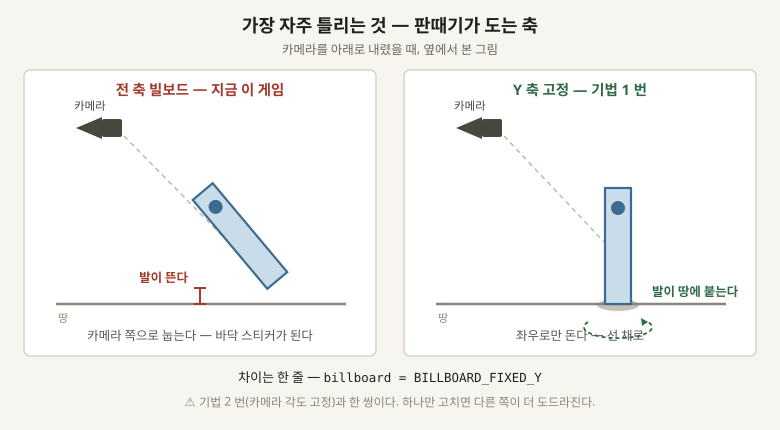

# 01 · 2D 판때기를 3D 에 넣을 때 어색하지 않게 하는 법

**이 게임의 몸은 전부 판때기다.** 검사도 늑대도 3D 모델이 아니라 **그림 한 장을 세워 둔 것**이고,
그 장이 카메라를 따라 돈다. **Bad North 가 정확히 이 방식이고, 그게 이 게임의 기준이다.**

> 「Bad North 의 그림 상당수가 2D 와 3D 의 경계를 흐리려고 한다 ... 유닛은 당연히 빌보드다.
> 그냥 빌보드되는 평면이다」 — 오스카 스톨베리, Konsoll 2018

⚠⚠ **판때기는 3D 에 그냥 서지지 않는다.** 스물여덟 군데에서 어긋나고, **어긋나면 「그림이 별로다」로
보이지 원인으로는 안 보인다.** 이 문서는 그 스물여덟 개다.



## 기법 스물여덟

**「크기」는 짜는 데 드는 품이다.** 작음 = 몇 줄 · 중간 = 한나절 · 큼 = 하루 이상.

### ㄱ. 어느 쪽을 보게 하나 — 다섯

| # | 기법 | 안 하면 | 어떻게 하나 | 지금 이 게임 | 크기 |
|---|---|---|---|---|---|
| **1** | **Y 축 고정 빌보드** | 모든 축으로 돌아서 카메라를 내리면 몸이 바닥에 눕는다 | 세로축으로만 돌린다. 고도는 `BILLBOARD_FIXED_Y` | ⚠ **전 축으로 돈다** | 작음 |
| **2** | **카메라 각도 고정** | 그림을 그린 각도와 보는 각도가 달라 몸이 찌그러진다 | 기울기를 한 값으로 못박고 그 각도로 그림을 그린다 | ⚠ **20 도에서 80 도까지 자유** | 작음 |
| **3** | **방향 여러 장** | 옆모습 한 장뿐이면 돌 때 미끄러진다 | 네 방향이 최소, 여덟이면 넉넉 | 늑대 넷 있음 | 중간 |
| **4** | **좌우 뒤집기** | 방향 장수가 두 배로 든다 | 왼쪽 그림을 뒤집어 오른쪽으로 쓴다. **Bad North 가 이걸 쓴다** | 안 씀 | 작음 |
| **5** | **임포스터** | 방향 그림을 손으로 다 그려야 한다 | **3D 모델을 각도별로 구워서 판때기에 붙인다.** 고도용 공개 구현이 있다 | 안 씀 | 큼 |

### ㄴ. 어떻게 그리나 — 여섯

| # | 기법 | 안 하면 | 어떻게 하나 | 지금 이 게임 | 크기 |
|---|---|---|---|---|---|
| **6** | **가장 가까운 점 확대** | 픽셀이 뭉개진다 | `TEXTURE_FILTER_NEAREST` | ✅ 됨 | 작음 |
| **7** | **밉맵·압축 끄기** | 멀어지면 흐려지고 색이 뭉갠다 | 들여오기 설정에서 둘 다 끈다 | ✅ 됨 | 작음 |
| **8** | **알파 잘라내기** | 반투명 판때기는 깊이값이 없어 절벽을 뚫고 그려진다 | 「이 픽셀은 있다/없다」로 자른다. `ALPHA_CUT_DISCARD` | ✅ 됨 | 작음 |
| **9** | **정렬 문제 다루기** | 판때기 여럿이 겹치면 앞뒤가 뒤바뀐다 | 8 번이 대부분 해결한다. 남는 건 그리는 순서를 손으로 정한다 | ✅ 8 번으로 덮임 | 중간 |
| **10** | **정사영 카메라** | 원근 카메라가 화면 가장자리 판때기를 기울여 보이게 한다 | 정사영을 쓰거나 화각을 아주 좁힌다 | ✅ 정사영 | 작음 |
| **11** | **픽셀 크기 맞추기** | 그림 픽셀과 세계 크기가 안 맞아 몸마다 해상도가 다르다 | 한 조각이 그림 몇 픽셀인지 정하고 전부 거기 맞춘다 | 한 조각 = 40 픽셀 | 작음 |

### ㄷ. 땅에 붙어 보이게 — 셋

| # | 기법 | 안 하면 | 어떻게 하나 | 지금 이 게임 | 크기 |
|---|---|---|---|---|---|
| **12** | **기준점을 발에** | 그림 한가운데가 땅에 박혀 몸이 반쯤 묻힌다 | 기준점을 그림 아래끝으로 내린다 | ✅ 됨 | 작음 |
| **13** | **접지 그림자** | 몸이 붕 떠 보인다 | 발밑에 어두운 동그라미를 깐다. **Bad North 는 1 픽셀짜리를 쓴다** | ✅ 동그라미 하나 | 작음 |
| **14** | **판때기 그림자는 쓰면 안 된다** | 카메라를 돌리면 그림자가 같이 돈다 — 그림자가 절대 하면 안 되는 짓 | 진짜 그림자를 끄고 13 번으로 대신한다 | ✅ 껐음 | 작음 |

### ㄹ. 빛을 어떻게 받나 — 둘

| # | 기법 | 안 하면 | 어떻게 하나 | 지금 이 게임 | 크기 |
|---|---|---|---|---|---|
| **15** | **노멀맵** | 몸만 통짜로 밝아 배경에서 떠 보인다 | 그림마다 「이 픽셀은 어디를 보나」를 담은 두 번째 그림을 붙인다 | ⚠⚠ **늑대 것을 구워 놓고 안 붙였다** | 중간 |
| **16** | **최소한 같은 환경광** | 배경은 어두운데 몸만 대낮이다 | 노멀맵이 없어도 환경광과 안개만은 똑같이 먹인다 | ⚠⚠ **빛을 아예 안 받는다** | 작음 |

### ㅁ. 2D 와 3D 를 한 그림으로 묶기 — 다섯

| # | 기법 | 안 하면 | 어떻게 하나 | 지금 이 게임 | 크기 |
|---|---|---|---|---|---|
| **17** | **외곽선** | 몸이 배경에 묻힌다 | 메시를 뒤집어 한 번 더 그린다. **Bad North 는 딱 1 픽셀** — 더 두꺼우면 뾰족한 자국이 생긴다 | 섬에는 있음 | 중간 |
| **18** | **저해상도로 그리고 확대** | 카메라가 움직일 때 픽셀이 스멀거린다 | 작은 화면에 그린 뒤 통째로 키운다 | ⚠ 3D 쪽은 안 함 | 중간 |
| **19** | **효과도 그림으로** | 픽셀 몸에 3D 파티클을 붙이면 딱 그 이음매에서 깨진다 | 이펙트도 스프라이트 시트로 만든다 | ⚠ 지금은 도형 | 중간 |
| **20** | **배경 디테일 낮추기** | 배경이 세밀하면 2D 몸이 초라해 보인다 | 저폴리, 단색, 무늬 없음 | ✅ 이미 그렇다 | — |
| **21** | **피사계 심도 · 틸트시프트** | 2D 와 3D 가 따로 논다 | 앞뒤를 흐려 **디오라마처럼 묶는다. Octopath Traveler 의 HD-2D 가 이걸로 푼다** | 안 씀 | 중간 |

### ㅂ. 자료에 잘 안 나오는데 실제로 걸리는 것 — 일곱

**아래 일곱은 강연이나 글에 잘 안 나온다.** 만들다 보면 부딪히는 것들이라 관행으로 돌아다닌다.

| # | 기법 | 안 하면 | 어떻게 하나 | 크기 |
|---|---|---|---|---|
| **22** | **세로 늘려 보정** | 카메라를 내릴수록 그림이 위아래로 짧아 보인다 | 기울기만큼 세로로 늘려 되돌린다. **기법 2 번(각도 고정)을 못 할 때의 대안** | 작음 |
| **23** | **살짝 뒤로 눕히기** | 완전히 수직인 판때기는 땅과 각이 져서 뻣뻣하다 | 10 ~ 15 도쯤 뒤로 눕힌다. 빛도 조금 받고 땅과 덜 싸운다 | 작음 |
| **24** | **깊이 조금 밀어주기** | 판때기 아래끝과 땅이 같은 깊이라 지지직거린다 | 카메라 쪽으로 아주 조금 민다 | 작음 |
| **25** | **가만히 있어도 미세하게 움직이기** | ⚠⚠ **멈춘 그림은 죽어 보인다.** 세상은 움직이는데 몸만 정지 화면이다 | 숨쉬기 두 장이면 된다. 위아래로 1 픽셀 | 작음 · **그림** |
| **26** | **색으로 배경에서 떼기** | 몸이 땅색에 묻힌다 | 몸을 배경보다 밝고 진하게. **Tooth and Tail 이 이걸로 푼다** | 작음 |
| **27** | **진영은 색, 병종은 크기** | 누가 내 편인지 한눈에 안 온다 | 색으로 편을 가르고 크기로 종류를 가른다. **이 저장소의 규칙이기도 하다** | 작음 |
| **28** | **키를 세계 크기로 못박기** | 그림을 다시 뽑을 때마다 몸 크기가 들쭉날쭉해진다 | 「검사는 몇 조각 키」를 값으로 정해 두고 그림이 바뀌어도 그 값을 지킨다 | 작음 |

⚠ **22 번과 2 번은 둘 중 하나다.** 각도를 고정할 수 있으면 22 번은 필요 없다.

## 헷갈리기 쉬운 것 셋

- **1 번과 2 번은 한 쌍이다** — 축만 고정하고 각도를 안 고정하면, 카메라를 내렸을 때 그림 위쪽이 짧아 보인다
- **8 번 알파 잘라내기가 9 번 정렬을 거의 다 해결한다** — 잘라내기가 진짜 깊이값을 주기 때문이다
- **15 번 노멀맵이 없어도 16 번은 할 수 있다** — 환경광만 맞춰도 「혼자 대낮」은 사라진다

## 서로 부딪히는 쌍

| 쌍 | 무슨 일이 나나 |
|---|---|
| **2 번 각도 고정 ↔ 카메라 자유 조작** | 각도를 못박으면 지금 있는 기울기 조작이 없어진다. **둘 중 하나를 버려야 한다** |
| **18 번 저해상도 ↔ 17 번 외곽선** | 1 픽셀 외곽선이 확대되면 굵어진다. 어느 해상도의 1 픽셀인지를 정해야 한다 |
| **21 번 흐리기 ↔ 6 번 가장 가까운 점** | 픽셀을 또렷하게 하려고 애쓴 뒤에 흐리는 것이라, 얼마나 흐리느냐가 곧 스타일이다 |

## 화면에서 켜 보기 — 실험대

```
.\Godot_v4.7.1-stable_win64.exe --path . --script res://docs/개발지식/01-2D-판때기를-3D에-넣기/lab.gd
```

**몸 셋이 나란히 선다.** 왼쪽은 스위치를 안 받는 대조군, 가운데가 스위치를 받는 쪽, 오른쪽은
절벽 뒤에 서 있다 — **알파 잘라내기(8 번)를 끄면 절벽을 뚫고 그려지는** 그 몸이다.

**스물여덟 개 중 열여섯이 붙어 있다.** 나머지 열둘은 들여오기 설정이거나(7 번), 그림이 있어야
하거나(25 번의 숨쉬기 그림), 화면 하나로는 안 갈리는 것들이다(19 · 20 · 21 번).

**↑↓ 로 고르고 스페이스로 켠다. A 전부 켜기, Z 전부 끄기.**
⚠⚠ **스위치 16 개면 볼 수 있는 화면은 65536 가지다.** 그 화면들은 만드는 게 아니라 켜는 것이고,
코드는 16 덩어리다.

⚠ **아직 화면에서 한 번도 안 돌려 봤다.** 문법과 이름은 훑었지만 고도가 없는 곳에서 쓴 것이다 —
안 뜨면 `docs/개발지식/README.md` 의 「안 뜨면 볼 곳 셋」부터 본다.


## 출처

⚠ **아래는 링크가 있는 것만이다.** ㅂ 절의 일곱과 표의 「지금 이 게임」 칸은 이 저장소를 직접 읽고 쓴 것이다.

- **Bad North 의 방식 전부** : `docs/reference/2026-08-30-reading-a-20px-unit.md` — 인용과 시각까지 있다
- **체크리스트와 이 게임 감사** : `docs/reference/2026-08-30-billboard-sprites-in-3d-checklist.md`
- [Alan Zucconi, Billboard Impostors](https://www.alanzucconi.com/2018/08/25/shader-showcase-saturday-7/) — 임포스터가 무엇인가
- [Godot Octahedral Impostors](https://github.com/SIsilicon/Godot-Octahedral-Impostors) — 고도용 공개 구현
- [HD-2D (위키백과)](https://en.wikipedia.org/wiki/HD-2D) — 피사계 심도로 묶는 방식
- [Octopath Traveler II 개발자 인터뷰](https://www.unrealengine.com/en-US/developer-interviews/octopath-traveler-ii-builds-a-bigger-bolder-world-in-its-stunning-hd-2d-style)
