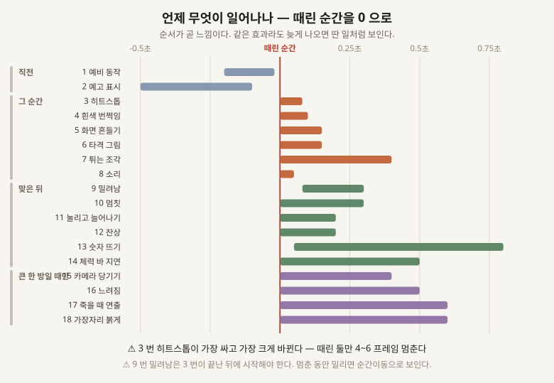

# 02 · 때리고 맞을 때 뭔가 일어난 것처럼 보이게 하는 법

**지금 늑대와 검사가 서로 때리는데 화면에서는 아무 일도 안 일어난다.** 숫자만 줄어든다.

⚠⚠ **여기 있는 것 중에 「진짜」인 건 하나도 없다.** 전부 눈속임이고, **눈속임인 걸 알아도 통한다.**
이 분야에는 두 개의 원전이 있다 — **「Juice it or lose it」(2012)** 과 **「The Art of Screenshake」
(2013)**. 아래는 그 둘과 이후 관행을 합친 것이다.

## 기법 스물여섯

**「언제」는 때린 순간을 0 으로 놓았을 때다.** 순서가 곧 느낌이라, 이 칸이 이름만큼 중요하다.

### ㄱ. 때리기 직전 — 둘

| # | 기법 | 무엇 | 언제 | 크기 |
|---|---|---|---|---|
| **1** | **예비 동작** | 때리기 전에 무기를 뒤로 뺀다. **없으면 맞는 쪽이 반응할 시간이 없어 부당하게 느껴진다** | −0.2 초쯤 | 중간 |
| **2** | **예고 표시** | 큰 공격은 바닥에 자국이나 빛으로 미리 알린다. 짐승이 커질수록 필요해진다 | −0.5 초쯤 | 중간 |

### ㄴ. 때린 그 순간 — 여섯

| # | 기법 | 무엇 | 언제 | 크기 |
|---|---|---|---|---|
| **3** | **히트스톱** | ⚠⚠ **때린 둘만 몇 프레임 멈춘다.** 나머지 세상은 계속 돈다. **이 목록에서 가장 값이 싸고 가장 크게 바뀐다** | 0 ~ 0.08 초 | 작음 |
| **4** | **흰색 번쩍임** | 맞은 몸이 한순간 흰색이 된다 | 0 ~ 0.1 초 | ✅ **이미 있음** |
| **5** | **화면 흔들기** | 카메라를 몇 픽셀 차고 빨리 제자리로. ⚠ **때린 방향으로 밀어야 한다** — 아무렇게나 떨면 싸구려가 된다 | 0 ~ 0.15 초 | 작음 |
| **6** | **타격 그림** | 베는 호 · 별 · 충격파 한 장을 맞은 자리에 띄운다 | 0 ~ 0.15 초 | 중간 · **그림 필요** |
| **7** | **튀는 조각** | 불똥·먼지·피가 **때린 방향으로** 흩어진다 | 0 ~ 0.4 초 | 중간 · **그림 필요** |
| **8** | **소리** | ⚠ **소리는 이 목록의 절반이다.** 화면 효과 없이 소리만 있어도 타격은 산다 | 0 | 중간 |

### ㄷ. 맞은 뒤 — 여섯

| # | 기법 | 무엇 | 언제 | 크기 |
|---|---|---|---|---|
| **9** | **밀려남** | 맞은 몸이 뒤로 밀린다. **직선이 아니라 빠르게 갔다 천천히 멎게** | 0 ~ 0.3 초 | 중간 · **sim** |
| **10** | **멈칫** | 맞은 몸이 잠깐 못 움직인다. 9 번과 다르다 — 이건 안 움직이는 것 | 0 ~ 0.3 초 | 작음 · **sim** |
| **11** | **눌리고 늘어나기** | 맞을 때 납작해지고 튈 때 늘어난다. ⚠ **부피가 그대로여야 한다** — 넓어지면 낮아진다 | 0 ~ 0.2 초 | 작음 |
| **12** | **잔상** | 빠른 동작에 흐린 자국을 남긴다 | 0 ~ 0.2 초 | 중간 · **그림 필요** |
| **13** | **숫자 뜨기** | 깎인 피가 몸 위로 떠오른다 | 0 ~ 0.8 초 | 중간 · **그림 필요** |
| **14** | **체력 바 지연 감소** | 빨간 칸이 즉시 줄고 흰 칸이 뒤늦게 따라 줄어 **얼마나 맞았는지**가 보인다 | 0 ~ 0.5 초 | 작음 |

### ㄹ. 크게 한 방일 때만 — 넷

| # | 기법 | 무엇 | 언제 | 크기 |
|---|---|---|---|---|
| **15** | **카메라 확 당기기** | 결정타에 화면이 살짝 줌인했다 돌아온다 | 0 ~ 0.4 초 | 작음 |
| **16** | **느려짐** | 세상 전체가 느려진다. ⚠ **히트스톱과 다르다** — 이건 멈추는 게 아니라 늦추는 것 | 0 ~ 0.5 초 | 작음 |
| **17** | **죽을 때 연출** | 쓰러짐 · 흩어짐 · 사라짐. **없으면 몸이 그냥 없어진다** | 죽는 순간 | 중간 |
| **18** | **화면 가장자리 신호** | 내가 크게 맞으면 화면 테두리가 붉어진다 | 0 ~ 0.6 초 | 작음 |

### ㅁ. 여덟이 한꺼번에 때릴 때 — 여덟

⚠⚠ **이 절이 이 게임에 제일 중요하고, 자료에는 거의 안 나온다.** 강연들은 대개 **한 명이 한 번
때리는** 이야기를 한다. **배 한 척이 늑대 여덟을 내리는 게임에서는 위의 열여덟을 그대로 켜면 화면이
발작한다.**

| # | 기법 | 무엇 | 크기 |
|---|---|---|---|
| **19** | **효과 누적 막기** | 여덟이 동시에 때리면 흔들기가 여덟 번 겹친다. **가장 센 것 하나만 남기고 나머지는 버린다** | 작음 |
| **20** | **소리 겹침 제한** | 같은 소리 여덟 개가 한 프레임에 겹치면 잡음 한 방이 된다. **동시에 셋까지** 같은 한계를 둔다 | 작음 |
| **21** | **소리 높낮이 흔들기** | 같은 소리를 그대로 반복하면 기계음이 된다. 재생할 때마다 높낮이를 조금씩 바꾼다 | 작음 |
| **22** | **마지막 한 방만 크게** | 카메라 당기기·느려짐을 매 타격에 쓰면 게임이 안 돌아간다. **죽이는 타격에만** | 작음 |
| **23** | **판정 프레임과 그림 프레임 나누기** | 그림상 칼이 닿아 보이는 순간과 실제로 피가 깎이는 순간은 **다른 값이다.** 하나로 묶으면 둘 다 못 고친다 | 중간 |
| **24** | **입력 버퍼** | 조금 일찍 누른 명령을 버리지 않고 담아 둔다. **없으면 사람이 「씹혔다」고 느낀다** | 작음 |
| **25** | **카메라가 맞은 쪽을 살짝 본다** | 큰 타격에서 시선이 따라간다. 5 번 흔들기와 다르다 | 작음 |
| **26** | **무기 궤적** | 휘두르는 길에 흐린 띠를 남긴다. 12 번 잔상의 무기판 | 중간 · **그림** |

## 하나만 고른다면 — 3 번 히트스톱

**때린 둘의 시간만 4 ~ 6 프레임 멈춘다.** 코드 몇 줄이고, **이 목록에서 「전혀 다른 게임 같다」는
말이 가장 자주 나오는 항목이다.** 캡콤의 벨트스크롤 액션들이 이걸로 알려져 있다.

⚠ **세상 전체를 멈추면 안 된다.** 멈추는 건 때린 놈과 맞은 놈뿐이고, 나머지는 계속 움직여야
「시간이 멈췄다」가 아니라 「무게가 실렸다」로 읽힌다.

## 서로 부딪히는 쌍

| 쌍 | 무슨 일이 나나 |
|---|---|
| **3 히트스톱 ↔ 5 화면 흔들기** | 하나는 시간을 멈추고 하나는 시간을 쓴다. **흔들기는 멈춘 동안에도 돌아야 한다** |
| **3 히트스톱 ↔ 9 밀려남** | 멈춘 동안 밀리면 순간이동으로 보인다. **밀림은 멈춤이 끝난 뒤에 시작** |
| **9 밀려남 ↔ sim 의 결정론** | 밀림이 위치를 바꾸므로 같은 판이 두 번 다르게 굴러갈 수 있다. ⚠⚠ **sim 안에서, 정해진 순서로** |
| **5 흔들기 ↔ 카메라 조작** | 흔드는 동안 사람이 카메라를 움직이면 둘이 싸운다. **흔들림은 카메라 위치에 더하는 값이어야 한다** |
| **16 느려짐 ↔ 전투 판정** | 세상을 늦추면 서브스텝 수가 바뀐다. **결정론이 걸린다** |

## 그림이 있어야 켤 수 있는 것 넷

**6 타격 그림 · 7 튀는 조각 · 12 잔상 · 13 숫자 · 26 무기 궤적.** 나머지 스물하나는 그림 없이 켤 수 있다.

## 출처

⚠ **아래는 링크가 있는 것만이다.** ㅁ 절의 여덟은 강연에 안 나오고, 여럿이 붙는 게임을 만들면 부딪히는 것들이다.

- [Juice it or lose it — Martin Jonasson & Petri Purho, Nordic Game Jam 2012](https://www.youtube.com/watch?v=Fy0aCDmgnxg) — 밋밋한 벽돌깨기에 효과를 무대에서 하나씩 얹는 강연. **이 분야의 원전**
- **The Art of Screenshake — Jan Willem Nijman (Vlambeer), 2013** — Nuclear Throne 을 만든 수법 서른 개를 빠르게 훑는 강연
- [Hitstop in Capcom Beat 'Em Ups](https://shane-sicienski.com/blog/blog-post-title-one-55pmn) — 히트스톱을 프레임 단위로 뜯은 글
- [How to Make Your Game Feel Good](https://egmatic.com/blog/how-to-make-your-game-feel-good) — 흔들기·되튐·히트스톱을 한 자리에 모은 정리
- **밖에서 찾아 둔 것** : `docs/reference/2026-08-30-hit-feel-techniques.md`
