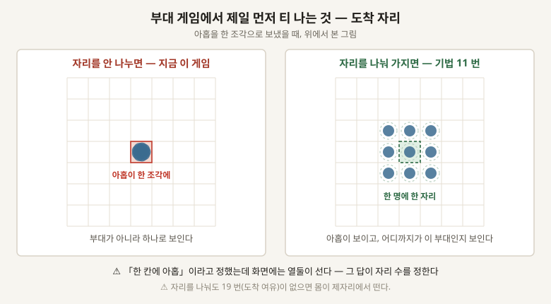

# 03 · 몸과 부대가 기분 좋게 움직이게 하는 법

**지금 검사는 명령한 자리까지 일정한 속도로 미끄러진다.** 출발도 도착도 없고, 여럿이면 한 점에 겹쳐 선다.

⚠⚠ **이 주제는 「길찾기」가 아니다.** 길은 이미 찾는다 — **찾은 길을 어떻게 걷느냐**가 여기다.
그리고 **부대 게임에서는 몸 하나보다 여럿이 같이 갈 때가 훨씬 어렵다.**

## 기법 스물여섯

**「어디」는 이 저장소의 폴더 규칙을 말한다.** `sim` 은 결정론이 걸려 있어 조심해야 하고,
`view` 는 보이는 것만이라 마음껏 고쳐도 된다.

### ㄱ. 명령한 순간 — 넷

| # | 기법 | 무엇 | 어디 | 크기 |
|---|---|---|---|---|
| **1** | **즉시 반응** | ⚠⚠ **누른 그 프레임에 무언가 화면에서 바뀌어야 한다.** 몸이 실제로 움직이기 전에라도. **이게 없으면 다른 열일곱을 다 해도 굼뜨게 느껴진다** | view | 작음 |
| **2** | **누른 자리 표시** | 클릭한 조각에 자국이 잠깐 뜬다 | view | 작음 · **그림** |
| **3** | **이동선** | 갈 길이 점선으로 보인다 | view | 중간 · **그림** |
| **4** | **명령 줄 세우기** | 명령을 이어 붙여 「여기 갔다가 저기」가 된다 | sim | 중간 |

### ㄴ. 몸 하나가 걷는 모양 — 여섯

| # | 기법 | 무엇 | 어디 | 크기 |
|---|---|---|---|---|
| **5** | **가속과 감속** | 출발할 때 붙고 도착할 때 잦아든다. ⚠ **직선 속도는 기계처럼 보인다** | sim | 작음 |
| **6** | **방향 돌 때 부드럽게** | 제자리에서 홱 도는 대신 도는 속도에 한계를 준다 | view 또는 sim | 작음 |
| **7** | **길 펴기** | 격자를 따라 계단처럼 가는 걸 곧은 선으로 편다. ✅ **이미 있다** | sim | — |
| **8** | **발 맞춰 걷기** | 걷기 그림의 프레임을 실제 이동 거리에 맞춘다. **안 맞으면 발이 땅에서 미끄러진다** | view | 작음 · **그림 없음** |
| **9** | **걸을 때 기울기** | 도는 쪽으로 몸이 살짝 기운다 | view | 작음 |
| **10** | **발자국 먼지** | 발이 닿는 자리에 흙먼지가 인다 | view | 중간 · **그림** |

### ㄷ. 여럿이 같이 갈 때 — 여섯

| # | 기법 | 무엇 | 어디 | 크기 |
|---|---|---|---|---|
| **11** | **도착 자리 나눠 갖기** | ⚠⚠ **한 점을 찍으면 아홉이 그 한 조각으로 몰린다.** 목적지 둘레의 자리를 미리 나눠 하나씩 배정한다 | sim | 중간 |
| **12** | **대형** | 부대가 줄·네모·쐐기 모양을 유지하며 간다. 각자 「자기 자리」를 따라간다 | sim | 큼 |
| **13** | **서로 안 겹치기** | 몸끼리 밀어내서 같은 자리에 두 개가 안 서게 한다 | sim | 큼 |
| **14** | **막히면 대형을 버린다** | 좁은 길에서는 대형을 포기하고 줄을 선다. ⚠ **안 하면 부대가 문 앞에서 멈춘다** | sim | 중간 |
| **15** | **흐름장** | 목적지에서 거꾸로 번져 나가는 방향 지도. 몸 하나하나가 길을 안 찾아도 된다. ✅ **이미 있다** | sim | — |
| **16** | **무리 이동** | 가까이 붙되 겹치지 않고, 같은 방향으로 함께 간다 | sim | 큼 |

### ㄹ. 도착한 뒤 — 둘

| # | 기법 | 무엇 | 어디 | 크기 |
|---|---|---|---|---|
| **17** | **정렬** | 다 도착하면 조금씩 자리를 고쳐 줄이 반듯해진다 | sim | 중간 |
| **18** | **선택 표시** | 지금 고른 부대가 누구인지 발밑에 보인다 | view | 작음 · **그림** |

### ㅁ. 자료에 잘 안 나오는데 반드시 부딪히는 것 — 여덟

**아래 여덟은 논문이나 글에 잘 안 나온다.** 알고리즘이 아니라 **알고리즘을 실제로 붙였을 때 생기는
일**이라, 만들어 본 사람들 사이에서 관행으로 돌아다닌다.

| # | 기법 | 안 하면 | 어디 | 크기 |
|---|---|---|---|---|
| **19** | **도착 여유** | ⚠⚠ **목적지에 「정확히」 닿으려 하면 몸이 그 자리에서 영원히 떤다.** 한 발 넘고 한 발 되돌아온다 | 반 조각쯤 여유를 주고 그 안에 들면 멈춘다 | 작음 |
| **20** | **서 있는 몸은 안 밀린다** | 지키라고 세워 둔 몸이 지나가는 몸에 밀려난다. **명령이 무시된 것으로 보인다** | 밀어내기에 「이 몸은 안 밀림」 표를 둔다 | 작음 |
| **21** | **부대 속도를 가장 느린 몸에 맞춘다** | 부대가 길게 늘어져서 부대로 안 보인다 | 제일 느린 몸의 속도로 전부 맞춘다 | 작음 |
| **22** | **경로 다시 계산하는 주기** | 매 프레임 다시 찾으면 느리고, 안 찾으면 막힌 데 붙어 선다 | 몇 프레임에 한 번, 그리고 막혔을 때만 | 중간 |
| **23** | **밀 때 누가 먼저인지** | 둘이 서로 밀며 제자리에서 진동한다 | 순서를 못박는다. ⚠⚠ **결정론이 여기 걸린다** | 중간 |
| **24** | **명령 받았다는 소리** | 화면에 아무것도 안 떠도 소리 하나면 반응이 산다. **가장 싼 즉시 반응** | 누를 때 짧은 소리 하나 | 작음 |
| **25** | **못 가는 자리를 찍었을 때** | 몸이 벽을 향해 밀며 서 있는다 | 가장 가까운 갈 수 있는 자리로 보내거나, 거절 표시를 낸다 | 작음 |
| **26** | **화면 밖 몸 계산 줄이기** | 안 보이는 몸의 회피 계산이 프레임을 먹는다 | 보이지 않으면 회피를 성기게 | 중간 |

⚠ **19 · 20 · 23 셋은 「버그처럼 보이는 것」이다.** 기능을 다 붙였는데 몸이 떨거나 밀려나면
알고리즘이 틀린 게 아니라 이 셋이 없는 것이다.

## 하나만 고른다면 — 11 번 도착 자리 나눠 갖기

**이게 없으면 나머지가 다 있어도 부대로 안 보인다.** 목적지 한 조각에 아홉이 겹쳐 서면
**부대가 아니라 하나로 보인다.**

⚠ **이 게임에는 이미 걸린 값이 있다** — 「한 칸에 아홉」이라고 정했는데 화면에는 열둘이 선다.
**그 답이 나와야 자리를 몇 개 나눌지가 정해진다.**

## 서로 부딪히는 쌍

| 쌍 | 무슨 일이 나나 |
|---|---|
| **12 대형 ↔ 13 서로 안 겹치기** | 대형은 「제자리로 가라」고 하고 밀어내기는 「비켜라」고 한다. **둘이 싸우면 몸이 부들부들 떤다** |
| **12 대형 ↔ 14 좁은 길** | 대형을 언제 버리는지를 정해야 한다. 안 정하면 문 앞에서 영원히 멈춘다 |
| **5 가속감속 ↔ 8 발 맞춰 걷기** | 속도가 변하면 걷기 프레임 속도도 같이 변해야 한다. 안 그러면 느릴 때 발이 미끄러진다 |
| **13 밀어내기 ↔ 결정론** | 누구를 먼저 미느냐로 결과가 갈린다. ⚠⚠ **순서를 못박아야 같은 판이 두 번 같이 굴러간다** |
| **1 즉시 반응 ↔ sim** | 화면이 먼저 반응하고 sim 이 뒤따르면 둘이 어긋난다. **화면만 먼저 움직이는 건 view 안에서** |

## 그림이 있어야 켤 수 있는 것 다섯

**2 누른 자리 · 3 이동선 · 8 발 맞춰 걷기 · 10 발자국 먼지 · 18 선택 표시.**
나머지 스물하나는 그림 없이 켤 수 있다.

## 출처

⚠ **아래는 링크가 있는 것만이다.** ㅁ 절의 여덟과 「어디」 칸은 이 저장소를 직접 읽고 쓴 것이다.

- [Group Pathfinding & Movement in RTS Style Games — Game Developer](https://www.gamedeveloper.com/programming/group-pathfinding-movement-in-rts-style-games) — 흐름장·대형·밀어내기를 한 자리에서 설명한다
- [Formation Movement for Real-Time Strategy Games — Andrew Cannon 학위논문](https://andrewtc.dev/thesis/) — 「자리 배정」이 무엇이고 왜 필요한지
- [RVO2 / ORCA](https://gamma.cs.unc.edu/RVO2/) — 서로 안 겹치게 하는 표준 방법
- **Bad North 의 우선순위** : 스톨베리는 순서를 이렇게 말한다 — **좋은 움직임 > 좋은 애니메이션 >
  잘생긴 캐릭터.** 인용은 `docs/reference/2026-08-30-reading-a-20px-unit.md` 에 있다
